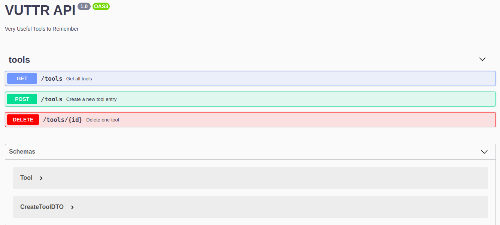

<h1 align="center">VUTTR - API</h1>

[travis-image]: https://api.travis-ci.org/nestjs/nest.svg?branch=master
[travis-url]: https://travis-ci.org/nestjs/nest
[linux-image]: https://img.shields.io/travis/nestjs/nest/master.svg?label=linux
[linux-url]: https://travis-ci.org/nestjs/nest

  <p align="center">Very Useful Tools to Remember</p>
    <p align="center">
<a href="https://travis-ci.org/nestjs/nest"></a>
  <a href="https://www.linkedin.com/in/wenderpmachado"></a>
</p>

## Description

VUTTR (Very Useful Tools to Remember) is a simple application to manage tools with their respective names, links, descriptions and tags.

> Challenge proposed by [Bossabox platform](https://bossabox.com/)

For the construction of the API it was used:

- NestJS
  - Node
  - Express
  - Typescript
  - Swagger
- Mongoose - MongoDB
- Jest (In progress)
- Docker (Not implemented yet)

## Installation

```bash
$ npm install
# or
$ yarn install
```

## Running the app

```bash
# development
$ npm run start
# or
$ yarn start

# watch mode
$ npm run start:dev
# or
$ yarn start:dev

# production mode
$ npm run start:prod
# or
$ yarn start:prod
```

## Test

```bash
# unit tests
$ npm run test
# or
$ yarn test

# e2e tests
$ npm run test:e2e
# or
$ yarn test:e2e

# test coverage
$ npm run test:cov
# or
$ yarn test:cov
```

## OpenAPI - Swagger

The API documentation is located in the `/api` endpoint.

> Ex: `http://localhost:3000/api/`


